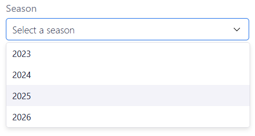
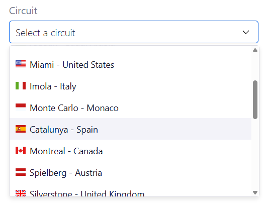
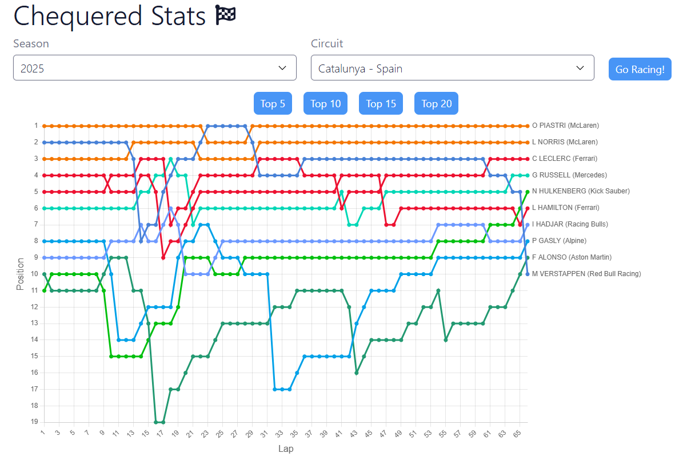

# F1 Race Position Visualiser

A web application for visualising Formula 1 race positions lap-by-lap using an interactive line graph. Processes raw lap and position telemetry data from the OpenF1 API to track position changes throughout a race.

---

## Prerequisites

- Node.js (recommended: Node.js 20+).

---

## Installation

### Client

Navigate to the client directory and install dependencies:

```bash
cd client
npm install --legacy-peer-deps
```

This project uses React 19, while one of the flag packages currently used by the application has peer dependency requirements which are present incompatible with React 19. The flag package works as intended.

### Server

Navigate to the server directory and install dependencies:

```bash
cd server
npm install
```

---

## Running the Application

## Environment Variables

Before running the application, create the required environment variable files. See the examples in both the client and server.

### Start the Client and Server

```bash
cd client
npm run dev
```

This will run the client and server concurrently. The application will now be available at:

```text
http://localhost:5173
```

---

# Using the Application

## 1. Select a Season

Choose a Formula 1 season from the Season dropdown menu.

Once selected, the application will automatically retrieve all races for that season.



---

## 2. Select a Race

After selecting a season, the Race dropdown will be populated with the available events from that year.

Choose the race you would like to analyse. Please note, there is a one week delay for the latest race, to allow time for the OpenF1 API to switch to historic race data - this application does not presently have access to live data.



---

## 3. View Race Position Changes

Once a race has been selected, the application will generate a line graph showing driver positions throughout the race. The top 10 finishing drivers are shown by default. You can currently filter the top 5, 15, 20 (or 22, depending on season) finishing positions.



---

## Acknowledgements

Special thanks to the team at [OpenF1 API](https://openf1.org/) for providing the data used by this application.

---

## Tech Stack

### Frontend

- React
- TypeScript
- Chart.js

### Backend

- Node.js
- Express
- TypeScript
- Axios

---

## Future Improvements

- The app doesn't currently take into account penalties applied after the race. See Alonso's finish at Melbourne in 2024 for example.
- Filtering by driver/team
- Support for other session types (free practice sessions, qualifying, sprints)
